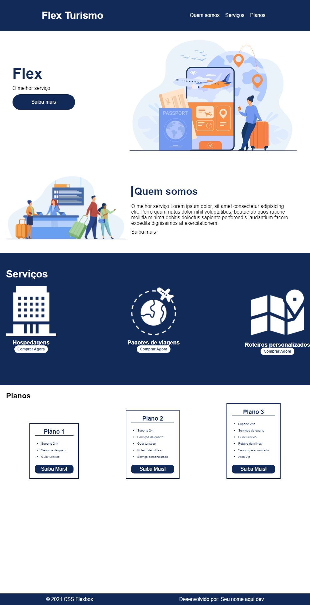

# Flex Box

Projeto desenvolvido no curso de Flex Box, ministrado por **[Karen Santos](https://www.linkedin.com/in/karenasantos/)**. É um curso magnífico, porém senti falta da aplicação dela no projeto, mesmo assim valeu muito apena porque fiquei sabendo de muita coisa que eu não sei nem conheço de **Flex Box**.

Segue uma imagem do mais ou menos de como fica o projeto:

### Como usar?

Simples (penso eu): 
1. Só fazer o download do arquivo pelas três via possíveis no github, ou 
2. Fazer um `$ git clone https://github.com/JulinoSD/felx_box.git`, neste caso vai precisar ter o _git_ instalado e bem configurado no computador [veja aqui](https://git-scm.com/book/pt-br/v2/Começando-Instalando-o-Git).
Fez isso:
1. Acesse a pasta `src > pages`;
2. Abra o arquivo `index.html` (é o único que vai encontrar na pasta);
3. Com o botão direito do mouse escolha abrir com o navegador de tua preferencia.
4. E pronto, tá rodando.

### Pode adicionar e refazer coisas?

Sinta-se livre de adicionar e refazer qualquer coisas, mesmo apartir deste repositório (se não quiser começar o seu), toda ajuda ou configuração é bem vinda.

`Att: Julino, seu aspirante à desenvolvedor`.